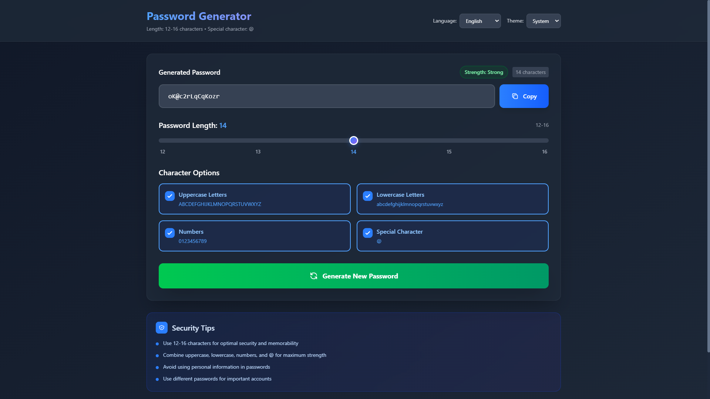

# 🔐 Password Generator (React + Tailwind CSS)

Ứng dụng **Trình Tạo Mật Khẩu Ngẫu Nhiên** được xây dựng bằng **React**
và **Tailwind CSS**, cho phép người dùng dễ dàng tạo mật khẩu mạnh mẽ,
có thể tùy chỉnh độ dài, loại ký tự, chủ đề giao diện và ngôn ngữ (🇻🇳
Tiếng Việt / 🇬🇧 English).

---

## 📸 Ảnh chụp màn hình



## 🚀 Tính Năng Chính

- ✅ Tạo mật khẩu mạnh ngẫu nhiên (12--16 ký tự)
- 🔡 Tùy chọn ký tự: Chữ hoa, chữ thường, số, ký tự đặc biệt (`@`)
- 💪 Hiển thị độ mạnh của mật khẩu theo thời gian thực (Weak / Medium
  / Strong)
- 🌗 Hỗ trợ 3 chế độ giao diện:
  - Sáng (Light)
  - Tối (Dark)
  - Theo hệ thống (System)
- 🌍 Hỗ trợ đa ngôn ngữ (Tiếng Việt / English)
- 📋 Sao chép mật khẩu chỉ với 1 click
- 💡 Hiển thị mẹo bảo mật hữu ích cho người dùng
- ✨ Giao diện hiện đại, có hiệu ứng animation mượt mà

---

## 🧩 Công Nghệ Sử Dụng

- **React 18+**
- **Tailwind CSS 3+**
- **JavaScript (ES6)**
- **Vite / CRA (tùy vào setup của bạn)**

---

## 📦 Cài Đặt & Chạy Ứng Dụng

### 1️⃣ Clone repository:

```bash
git clone https://github.com/mtrong100/Password-Generator.git
cd <your-repo-name>
```

### 2️⃣ Cài đặt dependencies:

```bash
npm install
```

### 3️⃣ Chạy ứng dụng:

```bash
npm run dev
```

> Sau đó truy cập <http://localhost:5173> (hoặc port khác mà Vite chỉ
> định).

---

## 🛠️ Cấu Trúc Chính

    src/
     ├─ App.jsx          # Giao diện và logic chính của ứng dụng
     ├─ index.jsx        # Điểm khởi động React
     ├─ styles/          # Cấu hình Tailwind CSS
     └─ assets/          # Hình ảnh, icon (nếu có)

---

## 🌈 Cách Sử Dụng

1.  Chọn **ngôn ngữ** (Tiếng Việt hoặc English)
2.  Chọn **giao diện** (Light / Dark / System)
3.  Điều chỉnh **độ dài mật khẩu** (12--16)
4.  Bật/tắt các loại ký tự bạn muốn sử dụng
5.  Nhấn **"Tạo Mật Khẩu Mới"**
6.  Sao chép mật khẩu bằng nút **"Copy"**

---

## 💡 Gợi Ý Bảo Mật

- Dùng mật khẩu dài ít nhất 12 ký tự\
- Kết hợp chữ hoa, chữ thường, số và ký tự đặc biệt\
- Không sử dụng thông tin cá nhân\
- Dùng mật khẩu khác nhau cho mỗi tài khoản

---

## 📄 Giấy Phép

Phát hành theo giấy phép **MIT License**.\
Bạn có thể tự do sử dụng, chỉnh sửa và phân phối lại mã nguồn này.

---

## 🧑‍💻 Tác Giả

**Tên:** \[SigmaProVip68]\
**Công nghệ:** React + Tailwind CSS\
**Năm:** 2025
